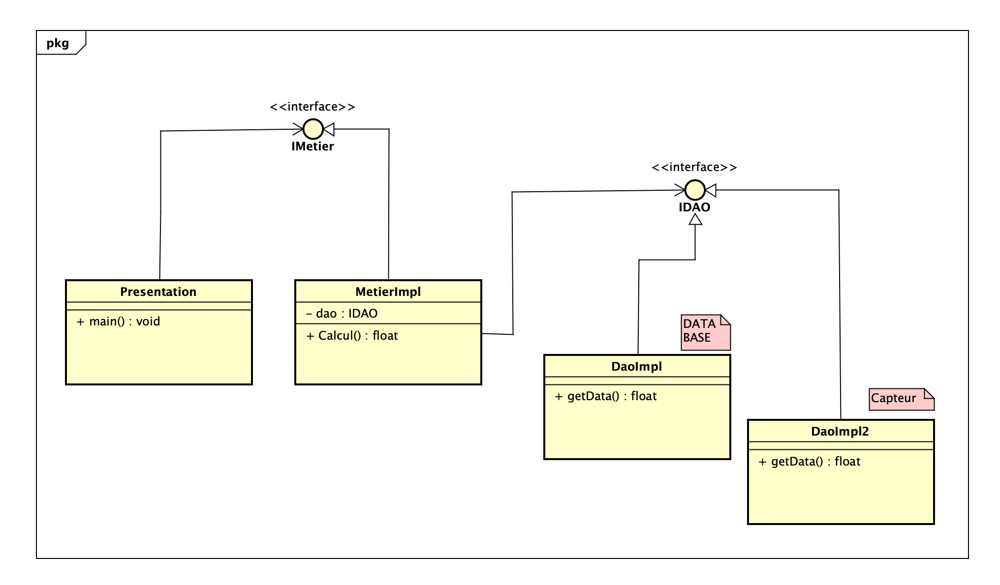

# Introduction

La maintenance des applications ouvertes à la modification est très difficile, c'est pourquoi nous utilisons le concept d'applications ouvertes à l'extension et fermées aux modifications qui nous permettent d'utiliser des interfaces pour implémenter différentes versions.

# Enoncé 

* Créer l’interface IDAO
* Créer une implémentation de l’interface IDAO
* Créer l’interface IMetier 
* Créer une implémentation de l’interface IMetier
* Créer la couche présentation en faisant l’injection de dépendances
- Par instanciation statique
- Par instanciation dynamique

# Conception

# Capture d'écran

## Instanciation statique

Version Base de données :

Version Capteur :

## Instanciation dynamique

Version Base de données :

Version Capteur :

## Conclusion

Dans ce travail, nous avons appliqué le concept d'application fermée à la modifications et ouverte à l'extension, et nous avons vu à quel point ce concept est pratique, et nous donne une application prête a l'extension. Nous avons également montré comment faire des instanciations statiques et dynamiques.
